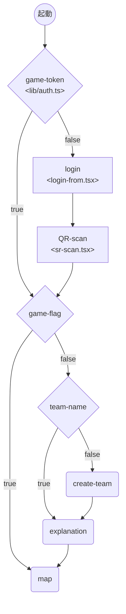

```mermaid
flowchart TB
  node_1(("起動"))
  node_3{"game-token\n#lt;lib/auth.ts#gt;"}
  node_2{"game-flag"}
  node_4["login\n#lt;login-from.tsx#gt;"]
  node_5["QR-scan\n#lt;sr-scan.tsx#gt;"]
  node_6("map")
  node_7{"team-name"}
  node_8("explanation")
  node_9("create-team")
  node_1 --> node_3
  node_3 --"true"--> node_2
  node_3 --"false"--> node_4
  node_4 --> node_5
  node_2 --"true"--> node_6
  node_2 --"false"--> node_7
  node_7 --"true"--> node_8
  node_7 --"false"--> node_9
  node_9 --> node_8
  node_8 --> node_6
  node_5 --> node_2
```